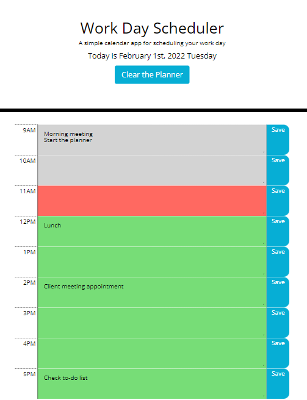

Bootcamp Week 5: Homework
# 05 Third-Party APIs: Work Day Scheduler

## Task Requirement

This daily planner comes with a starter code. The current day is displayed at the top of the calendar. To create a simple calendar application that allows a user to save events for each hour of the day in the "timeblocks" during standard business hours. This app will run in the browser and feature dynamically updated HTML and CSS powered by jQuery.

Needs to use the [Moment.js](https://momentjs.com/) library to work with date and time. Be sure to read the documentation carefully and concentrate on using Moment.js in the browser.

## User Story
```
AS AN employee with a busy schedule

I WANT to add important events to a daily planner

SO THAT I can manage my time effectively
```

## My Solution

I needed to code only in the "timeblocks" for standard business hours (from 9AM to 5PM). /init() function/

Each timeblock is color-coded to indicate whether it is in the past, present, or future. /colorPlanner() function/

All timeblocks are able to enter an hourly plan or to-do note, then saved by "Save" button. /button click event listener for each hour timeblock/

WHEN the "Save" button for that timeblock has clicked the text for that event is saved in local storage. That way the page is refreshed the saved events persist. Every time the page is refreshed, all color-code classes need to be removed then added to color-code again. Meantime, all the saved to-do notes need to be shown on the timeblocks. /refreshPlanner() function/

Also, I added "Clear the Planner" event, it gives a choice if a user wants a fresh start. Because the local storage is used throughout the day there could be a need to clear it all. /clears local storage and todoArray/

## Mock-Up

The following picture demonstrates the application appearance:

